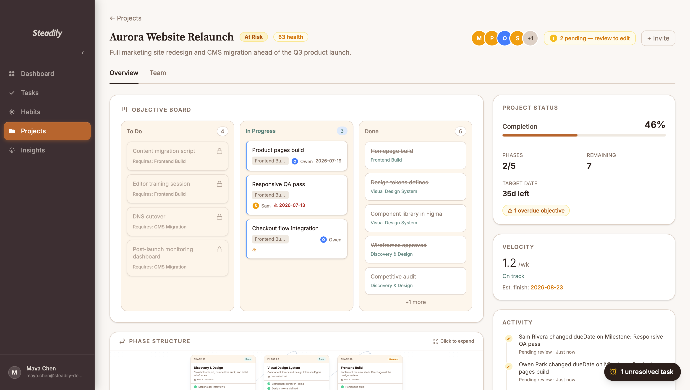
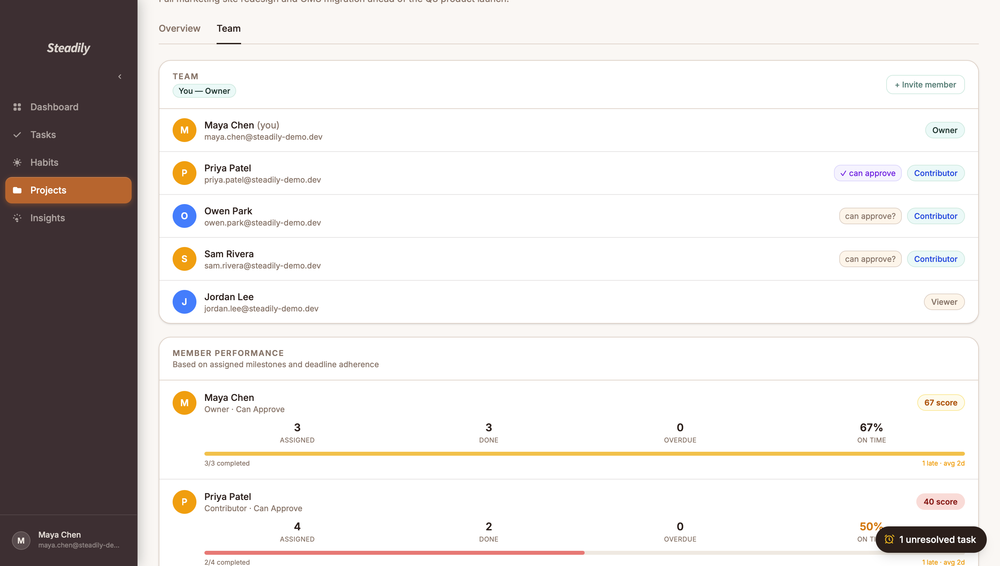
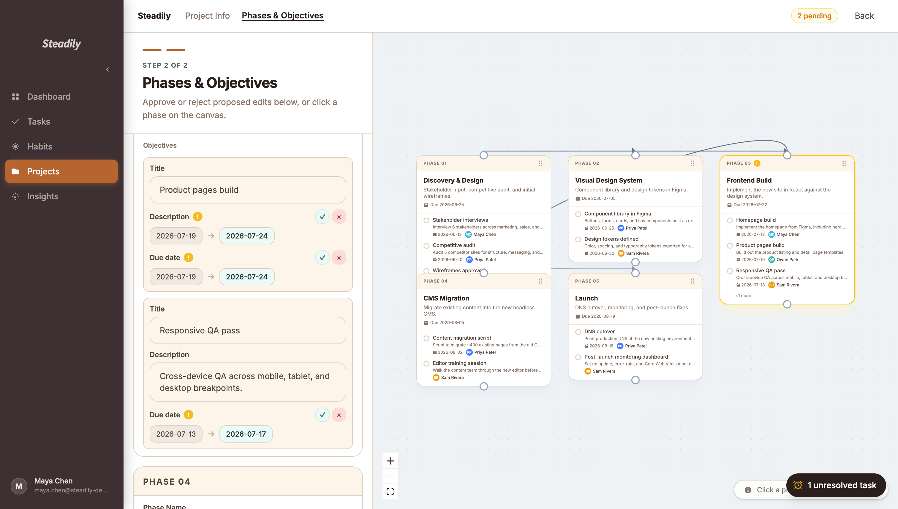
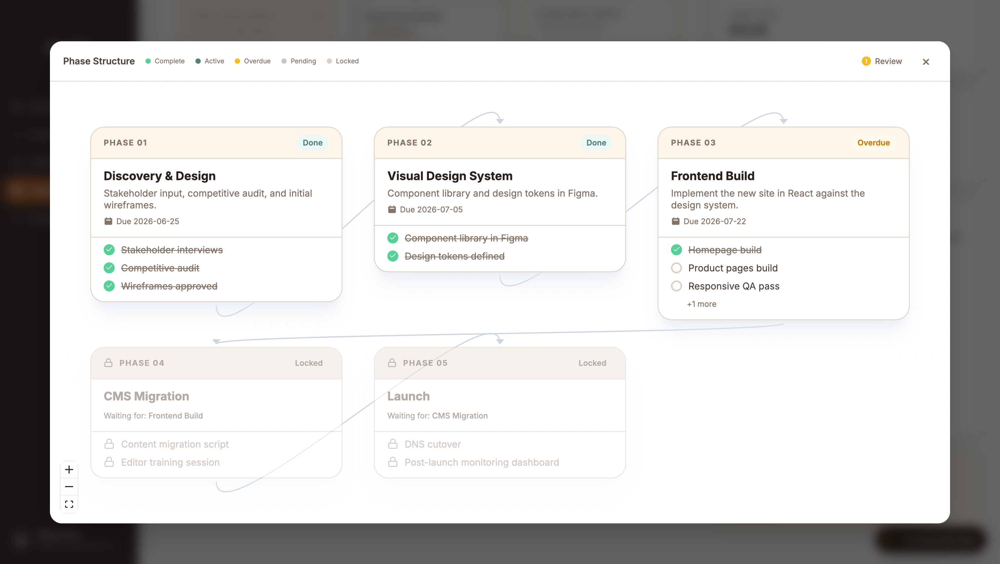
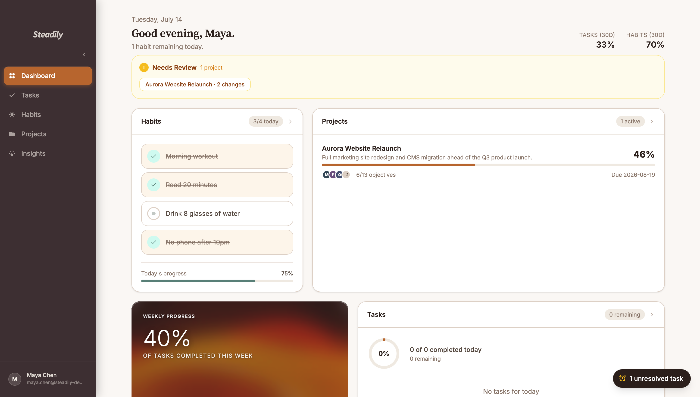
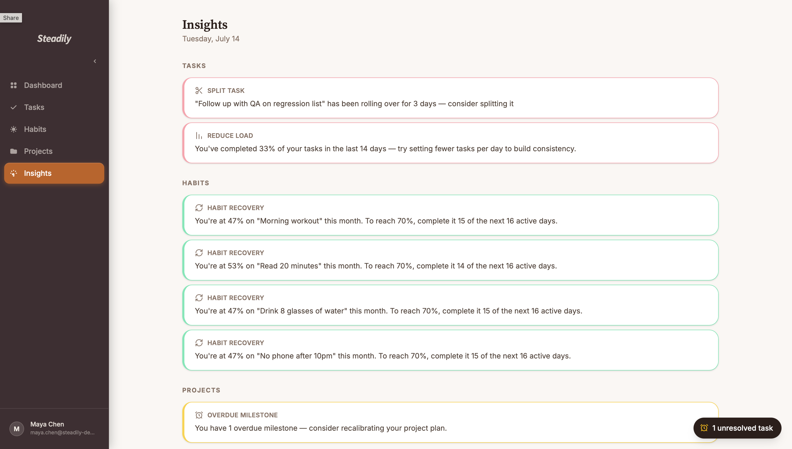

# Maturin

Maturin is a project-management and habit-tracking app built around a simple bet: most planning tools either track *everything* (and become a chore to maintain) or track *nothing real* (habit streaks with no consequence). Maturin sits in between — daily tasks, habits, and multi-person projects, all reasoned about the same way a real team would: who's allowed to change what, what happens when they don't agree, and what the actual trend line looks like once you stop guessing and start measuring.

**Live app:** [maturin.vercel.app](https://maturin.vercel.app)
**Backend:** Node.js/Express API on Render, PostgreSQL on Neon

> Free-tier hosting — the backend spins down after inactivity, so the first request after a while can take ~30s to wake up. After that it's normal speed.

---

## What it actually does

**Projects, with real governance.** Projects aren't single-owner to-do lists — they support teams with three roles (viewer / contributor / owner) plus a granular approval flag. The interesting part: when a contributor without approval rights edits a shared project's title, description, or due date, the change isn't just written to the database. It's diffed field-by-field against the current value, stored as a pending change, and routed to someone with sign-off authority — the same pattern behind PR review or Google Docs suggestions, just built from scratch for this domain.

**Phase dependencies you can actually see.** Projects break into phases and milestones, and phases can depend on each other. A phase locks automatically if anything it depends on isn't done yet, and the UI (built on React Flow) traces the full prerequisite chain for any phase you click — computed with a BFS-collect / DFS-order pass over the dependency graph, not eyeballed.

**Numbers that are actually computed, not just displayed.** Project health isn't a manually-set status — it's a weighted score from completion rate, overdue ratio, and recency of activity, recalculated on every request. Velocity tracking goes further: it looks at your actual completion rate over time and projects a realistic finish date, which it then compares against your original target.

**Habits with rollover and a real penalty model**, daily tasks with priority/time estimates and automatic rollover tracking, and a suggestion engine that watches for patterns — a task stuck rolling over for 3+ days, a habit quietly abandoned, milestones that keep slipping — and says something about it instead of staying silent.

**Auth that's built like it matters.** Password reset and email verification use single-use, time-boxed tokens (crypto-random, not UUIDs), passwords are hashed with bcrypt at cost factor 12, and the password-reset endpoint responds identically whether or not the email exists — so it can't be used to check who has an account.

---

## Screenshots

**Project overview** — health score, velocity forecast (actual pace vs. target, projected finish date), kanban board with locked/in-progress/done objectives, and a live activity feed of who changed what.


**Team & performance** — five roles in one project (owner, an approving contributor, two regular contributors, a viewer), plus per-member performance computed from actual assignment and deadline data — not everyone scores 100%.


**Field-level approval workflow** — a contributor without sign-off rights edited a due date and a description; each field shows up as its own diff, approved or rejected independently.


**Phase dependency graph** — completed phases, an active one, and two correctly locked downstream phases waiting on their prerequisites — computed, not manually set.


**Dashboard** — today's tasks and habits, project progress, and a pending-review banner surfacing changes that need a decision.


**Insights** — the suggestion engine reasoning over real data: a stalled task, habits below their recovery threshold, an overdue milestone.


---

## Tech stack

**Frontend** — React 19, TypeScript, React Router, React Flow (dependency graphs), Tailwind CSS, Axios
**Backend** — Node.js, Express 5, TypeScript, Prisma ORM
**Database** — PostgreSQL (Neon in production, SQLite for local dev)
**Auth & security** — JWT, bcrypt, Helmet, CORS allowlisting, tiered rate limiting (strict on auth endpoints, looser elsewhere)
**Email** — Resend, for verification, password reset, invites, and overdue-task reminders
**Infra** — Vercel (frontend), Render (backend), Neon (managed Postgres)

## Architecture, roughly

```
app/
├── backend/
│   ├── controllers/   # HTTP layer — request/response, validation, status codes
│   ├── services/      # business logic — permissions, diffing, scoring, email
│   ├── routes/        # 51 endpoints across 9 resource domains
│   └── middleware/     # JWT auth guard
├── frontend/
│   └── src/
│       ├── pages/       # routed views
│       ├── components/  # shared UI (modals, panels)
│       ├── context/      # auth state
│       └── api/          # typed API client
└── prisma/
    └── schema.prisma   # 14 models: users, tasks, habits, projects, phases,
                         # milestones, dependencies, memberships, invites,
                         # pending changes, and their join/token tables
```

The permission and approval logic lives entirely in the service layer, not in the controllers or the frontend — routes and UI just call it and react to the result, so there's exactly one place that decides who's allowed to do what.

## Running it locally

```bash
# backend (from repo root)
npm install
npx prisma migrate dev
npm run dev          # http://localhost:3001

# frontend
cd app/frontend
npm install
npm run dev           # http://localhost:5173
```

You'll need a `.env` at the root with `DATABASE_URL`, `JWT_SECRET`, `FRONTEND_URL`, and — if you want email flows to actually send — `RESEND_API_KEY` and `FROM_EMAIL`. Without a Resend key, email sends fail silently in dev and get logged to the console instead of blocking the request.

## Where this stands

This is an active solo project, not a finished product. The service layer (permissions, diffing, scoring) is the part I'm proudest of and the part I'd want reviewed most closely. CI runs on every push (typecheck + build, backend and frontend). Automated test coverage is the one thing I know is still missing and am actively working on next — everything above describes what's built and running today, not what's planned.
